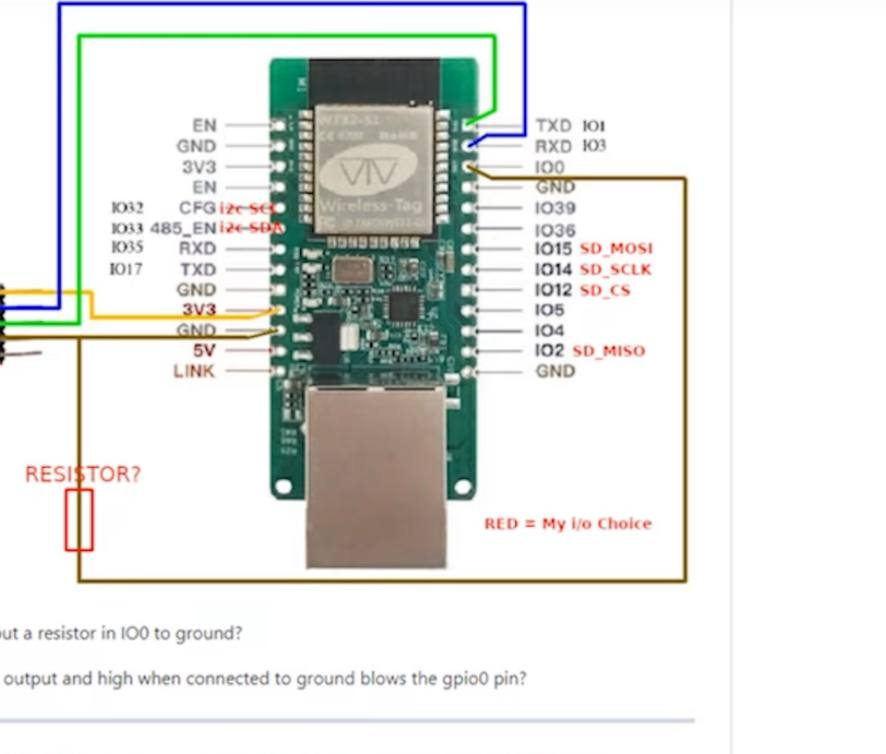

# EVERBLU_ESP32_arduino
# everblu-meters - Water usage data for Home Assistant
Fetch water/gas usage data from Cyble EverBlu meters using RADIAN protocol on 433Mhz. Intergrated with Home Assistant via MQTT. 
## Hardware

The project runs on ESP32 with an RF transreciver (CC1101). 

### Connections ESP32 to CC1101:

- See `cc1101.ccp` for SPI pins mapping.
- See `everblu_meters.h` for GDOx pins mapping.

Pins wiring for [wt21-eth01 board ~link~](https://files.seeedstudio.com/products/102991455/WT32-ETH01_datasheet_V1.1-%20en.pdf) [CC1101 8-pin DATASHEETS ~link~]((https://www.m2mmarket.com.tr/Data/EditorFiles/E07-M1101D-SMA_Datasheet_EN_v1.0_1.pdf)) :
|CC1101|Wemos|
|--|--|
|VCC|3V3|
|GOD0 (GDO0) |gpio 14|
|CSN (SPI chip select) |gpio 0|
|SCK (SPI clock)|gpio 12|
|MOSI (SPI MOSI) |gpio 32|
|GOD1 (SPI MISO)|gpio 4|
|GOD2 (GDO2) |not inst|
|GND (ground)|GND|

